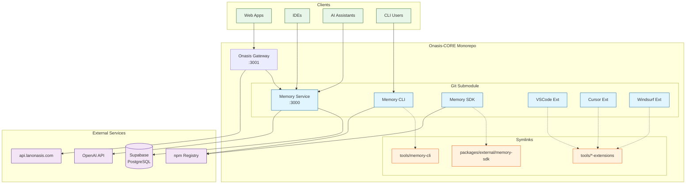
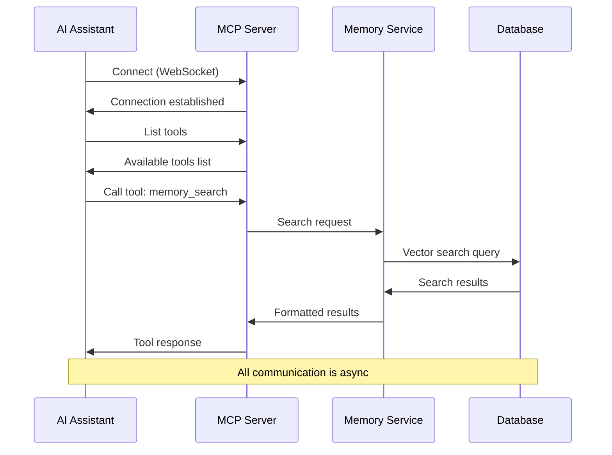
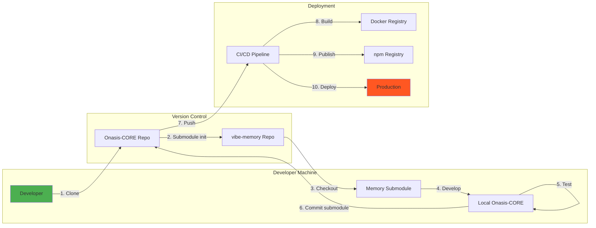
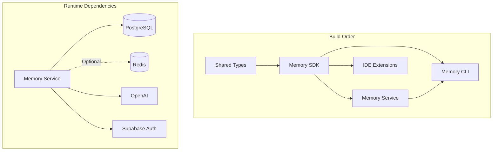
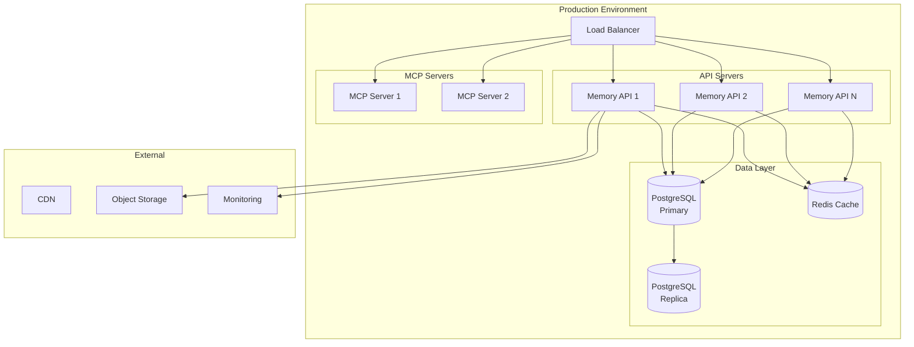
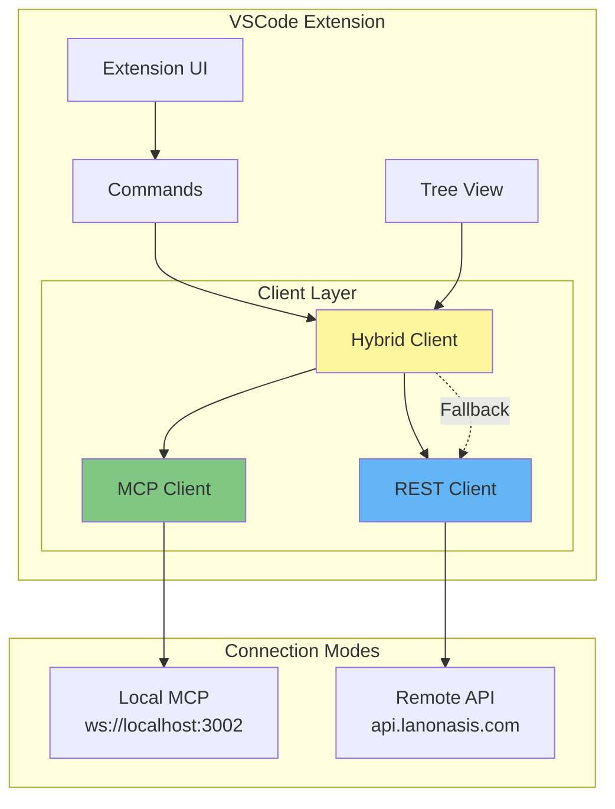

# Memory Service Architecture Diagrams

## Overall Integration Architecture

## MCP Communication Flow

## Development Workflow

## Service Dependencies

## Deployment Architecture

## Extension Architecture

