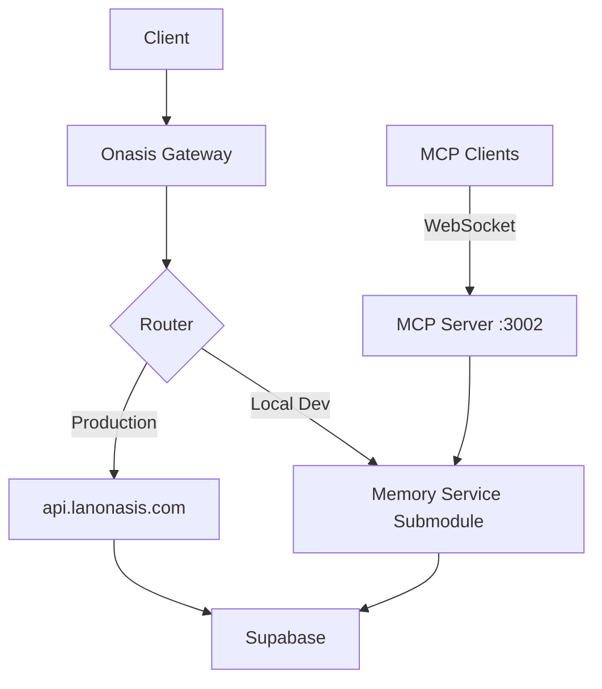

# 📚 Memory Service Suite Integration Guide

## Table of Contents

1. [Overview](#overview)
2. [Architecture](#architecture)
3. [Prerequisites](#prerequisites)
4. [Integration Steps](#integration-steps)
5. [Component Details](#component-details)
6. [Development Workflow](#development-workflow)
7. [Deployment Strategy](#deployment-strategy)
8. [MCP Integration](#mcp-integration)
9. [Troubleshooting](#troubleshooting)
10. [Maintenance](#maintenance)
11. [Best Practices](#best-practices)
12. [FAQ](#faq)

---

## 🎯 Overview

This guide provides comprehensive instructions for integrating the Memory as a Service (MaaS) suite into the Onasis-CORE monorepo using git submodules. This approach maintains the independence of the vibe-memory repository while providing unified development and deployment capabilities.

### Key Benefits

- **🔄 Independent Development** - vibe-memory remains a separate repository
- **📦 Unified Workspace** - Single development environment for all services
- **🚀 Commercial Ready** - npm packages and extensions remain deployable
- **🤖 MCP Enhanced** - Full Model Context Protocol support across all components
- **🔒 Privacy First** - Integrated with Onasis-CORE privacy layer

### Components Included

1. **Memory Service API** - RESTful API with vector search
2. **Memory SDK** - TypeScript/JavaScript client library
3. **Memory CLI** - Command-line interface with MCP server
4. **VSCode Extension** - IDE integration with MCP
5. **Cursor Extension** - Cursor IDE support
6. **Windsurf Extension** - Windsurf IDE support

---

## 🏗️ Architecture

### Repository Structure

```
Onasis-CORE/
├── services/
│   ├── api-gateway/          # Existing gateway service
│   ├── memory-service/       # Git submodule: vibe-memory
│   │   ├── src/             # Memory service source
│   │   ├── cli/             # CLI tool
│   │   ├── packages/        # SDK package
│   │   ├── vscode-extension/
│   │   ├── cursor-extension/
│   │   └── windsurf-extension/
│   └── memory-integration.js # Integration layer
├── packages/
│   └── external/
│       └── memory-sdk/      # Symlink to memory-service/packages
├── tools/
│   ├── memory-cli/          # Symlink to memory-service/cli
│   ├── vscode-memory-extension/
│   ├── cursor-memory-extension/
│   └── windsurf-memory-extension/
└── deployment/
    └── deploy-memory-suite.sh
```

### Service Communication



---

## 📋 Prerequisites

### System Requirements

- **Node.js** 18.0.0 or higher
- **npm** 8.0.0 or higher
- **Git** 2.30.0 or higher (with submodule support)
- **Docker** (optional, for containerized deployment)

### Required Accounts

1. **GitHub Access**
   - Read access to `https://github.com/lanonasis/vibe-memory`
   - Write access to Onasis-CORE repository

2. **npm Account** (for publishing)
   - Access to @lanonasis organization
   - Publishing rights for packages

3. **Service Credentials**
   ```env
   # Required environment variables
   SUPABASE_URL=your_supabase_url
   SUPABASE_ANON_KEY=your_anon_key
   SUPABASE_SERVICE_KEY=your_service_key
   OPENAI_API_KEY=your_openai_key
   JWT_SECRET=your_jwt_secret
   ```

### Development Tools

- **VSCode** (for extension development)
- **vsce** CLI tool: `npm install -g vsce`
- **Turbo** (installed with Onasis-CORE)

---

## 🚀 Integration Steps

### Step 1: Initial Setup

```bash
# Navigate to Onasis-CORE root
cd /Users/seyederick/DevOps/_project_folders/Onasis-CORE

# Ensure you're on the correct branch
git checkout main
git pull origin main

# Make scripts executable
chmod +x setup-memory-submodules.sh
chmod +x enhance-extensions-mcp.sh
chmod +x deployment/deploy-memory-suite.sh
```

### Step 2: Add Submodule

```bash
# Run the setup script
./setup-memory-submodules.sh

# This script will:
# 1. Add vibe-memory as a git submodule
# 2. Create symlinks for all components
# 3. Update .gitmodules
# 4. Create integration files
```

#### Manual Submodule Addition (if script fails)

```bash
# Add submodule manually
git submodule add https://github.com/lanonasis/vibe-memory services/memory-service
git submodule update --init --recursive

# Create symlinks
ln -s ../../services/memory-service/packages packages/external/memory-sdk
ln -s ../services/memory-service/cli tools/memory-cli
ln -s ../services/memory-service/vscode-extension tools/vscode-memory-extension
ln -s ../services/memory-service/cursor-extension tools/cursor-memory-extension
ln -s ../services/memory-service/windsurf-extension tools/windsurf-memory-extension
```

### Step 3: Update Workspace Configuration

#### Update package.json

```json
{
  "name": "onasis-core",
  "workspaces": [
    "packages/*",
    "services/*",
    "tools/*",
    "services/memory-service",
    "services/memory-service/cli",
    "services/memory-service/packages",
    "services/memory-service/vscode-extension",
    "services/memory-service/cursor-extension",
    "services/memory-service/windsurf-extension"
  ]
}
```

#### Update turbo.json

```json
{
  "$schema": "https://turbo.build/schema.json",
  "pipeline": {
    // Existing pipelines...
    
    // Memory Service pipelines
    "memory-service#dev": {
      "cache": false,
      "dependsOn": ["^build"],
      "env": [
        "SUPABASE_URL",
        "SUPABASE_ANON_KEY",
        "OPENAI_API_KEY"
      ]
    },
    "memory-service#build": {
      "outputs": ["dist/**"],
      "dependsOn": ["^build"]
    },
    "memory-service#test": {
      "dependsOn": ["build"],
      "outputs": ["coverage/**"]
    },
    "@lanonasis/cli#build": {
      "outputs": ["dist/**"],
      "dependsOn": ["memory-service#build"]
    },
    "@lanonasis/memory-client#build": {
      "outputs": ["dist/**", "lib/**"]
    },
    "lanonasis-memory#build": {
      "outputs": ["out/**", "*.vsix"],
      "dependsOn": ["@lanonasis/memory-client#build"]
    }
  }
}
```

### Step 4: Enhance Extensions with MCP

```bash
# Run MCP enhancement script
./enhance-extensions-mcp.sh

# This will:
# 1. Add @modelcontextprotocol/sdk to extensions
# 2. Create MCP integration files
# 3. Update extension configurations
# 4. Add hybrid client support
```

### Step 5: Environment Configuration

```bash
# Copy environment template
cp .env.memory.example .env

# Edit .env file with your credentials
vi .env
```

#### Required Environment Variables

```env
# Memory Service Configuration
MEMORY_SERVICE_URL=https://api.lanonasis.com
USE_LOCAL_MEMORY=true  # Use local submodule in development

# Database Configuration
SUPABASE_URL=https://your-project.supabase.co
SUPABASE_ANON_KEY=your_anon_key
SUPABASE_SERVICE_KEY=your_service_key

# AI Configuration
OPENAI_API_KEY=sk-...

# Authentication
JWT_SECRET=your-secret-key-min-32-chars

# MCP Configuration
ENABLE_MEMORY_MCP=true
MEMORY_MCP_PORT=3002
MEMORY_MCP_HOST=0.0.0.0

# Optional: Redis for caching
REDIS_URL=redis://localhost:6379
```

### Step 6: Install Dependencies

```bash
# Install all dependencies
npm install

# Or using specific workspaces
npm install --workspace=services/memory-service
npm install --workspace=services/memory-service/cli
npm install --workspace=services/memory-service/packages
```

### Step 7: Verify Integration

```bash
# Run health checks
node scripts/health-check.js

# Test memory service
curl http://localhost:3000/api/memory/health

# Test MCP server
npx -y @lanonasis/cli mcp test
```

---

## 📦 Component Details

### Memory Service API

**Location**: `services/memory-service/`

#### Key Features
- RESTful API with OpenAPI documentation
- Vector search using OpenAI embeddings
- Multi-tenant with RLS policies
- JWT and API key authentication
- Rate limiting and caching

#### Endpoints
```
POST   /api/v1/memory          # Create memory
GET    /api/v1/memory          # List memories
GET    /api/v1/memory/:id      # Get specific memory
PUT    /api/v1/memory/:id      # Update memory
DELETE /api/v1/memory/:id      # Delete memory
POST   /api/v1/memory/search   # Semantic search
GET    /api/v1/memory/stats    # Usage statistics
```

#### Development
```bash
# Start locally
cd services/memory-service
npm run dev

# Or through Turbo
turbo run dev --filter=memory-service
```

### Memory SDK

**Location**: `packages/external/memory-sdk/`
**npm**: `@lanonasis/memory-client`

#### Installation
```bash
npm install @lanonasis/memory-client
```

#### Usage
```typescript
import { createMemoryClient } from '@lanonasis/memory-client';

const client = createMemoryClient({
  baseURL: 'https://api.lanonasis.com',
  apiKey: 'your-api-key'
});

// Create memory
const memory = await client.createMemory({
  title: 'Important Note',
  content: 'This is the content',
  memory_type: 'knowledge',
  tags: ['important']
});

// Search memories
const results = await client.searchMemories({
  query: 'important notes',
  limit: 10
});
```

### Memory CLI

**Location**: `tools/memory-cli/`
**npm**: `@lanonasis/cli`

#### Installation
```bash
# Global installation
npm install -g @lanonasis/cli

# Or use npx
npx -y @lanonasis/cli --help
```

#### Commands
```bash
# Authentication
lanonasis auth login
lanonasis auth status

# Memory operations
lanonasis create -t "Title" -c "Content"
lanonasis search "query"
lanonasis list --limit 20

# MCP server mode
lanonasis mcp start
lanonasis mcp tools
lanonasis mcp test
```

### IDE Extensions

#### VSCode Extension
**Location**: `tools/vscode-memory-extension/`

##### Building
```bash
cd tools/vscode-memory-extension
npm install
npm run compile
npm run package  # Creates .vsix file
```

##### Installing
```bash
# Install from VSIX
code --install-extension lanonasis-memory-1.0.0.vsix

# Or install from marketplace (when published)
code --install-extension lanonasis.lanonasis-memory
```

##### Configuration
```json
{
  "lanonasis.apiUrl": "https://api.lanonasis.com",
  "lanonasis.apiKey": "your-api-key",
  "lanonasis.enableMCP": true,
  "lanonasis.mcpServerUrl": "ws://localhost:3002"
}
```

---

## 💻 Development Workflow

### Starting Development Environment

#### Option 1: Unified Start
```bash
# Start everything
./start-with-memory.sh
```

#### Option 2: Individual Services
```bash
# Terminal 1: Start Onasis-CORE
npm run dev

# Terminal 2: Start Memory Service
cd services/memory-service
npm run dev

# Terminal 3: Start MCP Server
npx -y @lanonasis/cli mcp start
```

#### Option 3: Using Turbo
```bash
# Start all development servers
turbo run dev

# Start specific service
turbo run dev --filter=memory-service
turbo run dev --filter=@lanonasis/cli
```

### Building

```bash
# Build everything
turbo run build

# Build memory components only
turbo run build --filter=...memory-service

# Build specific component
turbo run build --filter=@lanonasis/memory-client
```

### Testing

```bash
# Run all tests
turbo run test

# Test memory service
turbo run test --filter=memory-service

# Test with coverage
turbo run test:coverage --filter=memory-service

# Test MCP integration
./test-mcp-extensions.sh
```

### Code Quality

```bash
# Lint all code
turbo run lint

# Type checking
turbo run type-check

# Format code
turbo run format
```

---

## 🚢 Deployment Strategy

### Automated Deployment

```bash
# Deploy complete suite
./deployment/deploy-memory-suite.sh production

# Deploy to staging
./deployment/deploy-memory-suite.sh staging
```

### Manual Deployment Steps

#### 1. Deploy Memory Service API

```bash
cd services/memory-service

# Build Docker image
docker build -t lanonasis/memory-service:latest .

# Push to registry
docker push lanonasis/memory-service:latest

# Deploy to Kubernetes
kubectl apply -f k8s/

# Or deploy to specific service
fly deploy  # Fly.io
heroku container:push web  # Heroku
```

#### 2. Publish npm Packages

```bash
# Publish SDK
cd services/memory-service/packages
npm version patch
npm publish --access public

# Publish CLI
cd ../cli
npm version patch
npm publish --access public
```

#### 3. Release IDE Extensions

```bash
# VSCode Extension
cd services/memory-service/vscode-extension
vsce package
vsce publish

# Submit to other marketplaces manually
# - Cursor: Upload .vsix to Cursor marketplace
# - Windsurf: Upload .vsix to Windsurf marketplace
```

### CI/CD Pipeline

```yaml
# .github/workflows/deploy-memory.yml
name: Deploy Memory Suite

on:
  push:
    paths:
      - 'services/memory-service/**'
    branches:
      - main

jobs:
  deploy:
    runs-on: ubuntu-latest
    steps:
      - uses: actions/checkout@v3
        with:
          submodules: recursive
      
      - name: Setup Node.js
        uses: actions/setup-node@v3
        with:
          node-version: '18'
      
      - name: Install dependencies
        run: npm ci
      
      - name: Build
        run: turbo run build --filter=...memory-service
      
      - name: Test
        run: turbo run test --filter=...memory-service
      
      - name: Deploy
        run: ./deployment/deploy-memory-suite.sh production
        env:
          NPM_TOKEN: ${{ secrets.NPM_TOKEN }}
          DOCKER_TOKEN: ${{ secrets.DOCKER_TOKEN }}
```

---

## 🤖 MCP Integration

### MCP Server Configuration

The Memory Service includes a built-in MCP server that can be used by AI assistants.

#### Starting MCP Server

```bash
# Standalone mode
npx -y @lanonasis/cli mcp start

# With custom port
npx -y @lanonasis/cli mcp start --port 8080

# With authentication
LANONASIS_API_KEY=your-key npx -y @lanonasis/cli mcp start
```

#### Available MCP Tools

1. **memory_create_memory** - Create new memories
2. **memory_search_memories** - Semantic search
3. **memory_list_memories** - List memories with filters
4. **memory_get_memory** - Get specific memory
5. **memory_update_memory** - Update existing memory
6. **memory_delete_memory** - Delete memory
7. **memory_bulk_create** - Create multiple memories
8. **memory_bulk_delete** - Delete multiple memories
9. **memory_get_stats** - Get usage statistics
10. **memory_export_data** - Export memories
11. **memory_import_data** - Import memories

### AI Assistant Configuration

#### Claude Desktop

```json
// ~/Library/Application Support/Claude/claude_desktop_config.json
{
  "mcpServers": {
    "memory-service": {
      "command": "npx",
      "args": ["-y", "@lanonasis/cli", "mcp", "start"],
      "env": {
        "LANONASIS_API_KEY": "your-api-key-here",
        "MEMORY_SERVICE_URL": "https://api.lanonasis.com"
      }
    }
  }
}
```

#### Cursor IDE

```json
// Cursor Settings
{
  "mcp.servers": {
    "memory-service": {
      "command": "npx",
      "args": ["-y", "@lanonasis/cli", "mcp", "start"],
      "env": {
        "LANONASIS_API_KEY": "your-api-key"
      }
    }
  }
}
```

#### Windsurf IDE

```json
// Windsurf Configuration
{
  "mcp": {
    "servers": {
      "lanonasis-memory": {
        "command": "lanonasis",
        "args": ["mcp", "start"],
        "transport": "stdio"
      }
    }
  }
}
```

### MCP in IDE Extensions

The enhanced IDE extensions support MCP natively:

```typescript
// Extension automatically detects MCP mode
const client = new HybridMemoryClient();
await client.initialize();

// Uses MCP if available, falls back to REST
const results = await client.searchMemories('query');
```

---

## 🔧 Troubleshooting

### Common Issues

#### Submodule Not Found

```bash
# Error: No submodule mapping found
# Solution:
git submodule init
git submodule update --recursive
```

#### Permission Denied

```bash
# Error: Permission denied accessing submodule
# Solution:
ssh-add ~/.ssh/id_rsa  # Add SSH key
git config --global url."git@github.com:".insteadOf "https://github.com/"
```

#### Build Failures

```bash
# Error: Cannot find module
# Solution:
rm -rf node_modules package-lock.json
npm install
turbo run build --force
```

#### MCP Connection Failed

```bash
# Error: Cannot connect to MCP server
# Solution:
# 1. Check if port is available
lsof -i :3002

# 2. Start MCP server manually
npx -y @lanonasis/cli mcp start --debug

# 3. Check firewall settings
sudo ufw allow 3002/tcp
```

#### Extension Not Loading

```bash
# Error: Extension failed to activate
# Solution:
# 1. Check extension logs
code --verbose

# 2. Reinstall extension
code --uninstall-extension lanonasis.lanonasis-memory
code --install-extension ./lanonasis-memory-1.0.0.vsix

# 3. Clear extension cache
rm -rf ~/.vscode/extensions/lanonasis.lanonasis-memory*
```

### Debug Mode

```bash
# Enable debug logging
export DEBUG=memory:*
export LOG_LEVEL=debug

# Run with verbose output
npm run dev -- --verbose

# MCP debug mode
npx -y @lanonasis/cli mcp start --debug --log-level=trace
```

### Health Checks

```bash
# Check all services
curl -s http://localhost:3000/api/v1/health | jq .
curl -s http://localhost:3001/health | jq .
curl -s http://localhost:3002/health | jq .

# Check MCP tools
npx -y @lanonasis/cli mcp tools --json | jq .

# Test memory operations
npx -y @lanonasis/cli create -t "Test" -c "Health check test"
npx -y @lanonasis/cli search "health check"
```

---

## 🛠️ Maintenance

### Updating Submodules

#### Update to Latest

```bash
# Update submodule to latest commit
git submodule update --remote --merge services/memory-service

# Commit the update
git add services/memory-service
git commit -m "Update memory-service to latest version"
```

#### Update to Specific Version

```bash
# Navigate to submodule
cd services/memory-service

# Checkout specific tag/commit
git checkout v1.2.0

# Return and commit
cd ../..
git add services/memory-service
git commit -m "Update memory-service to v1.2.0"
```

### Version Management

```bash
# Script: sync-versions.sh
#!/bin/bash

# Get version from main package
VERSION=$(cd services/memory-service && node -p "require('./package.json').version")
echo "Syncing to version: $VERSION"

# Update all components
for component in cli packages vscode-extension cursor-extension windsurf-extension; do
  echo "Updating $component..."
  cd services/memory-service/$component
  npm version $VERSION --no-git-tag-version
  cd -
done

# Commit changes
git add services/memory-service
git commit -m "Sync all components to version $VERSION"
```

### Monitoring

```bash
# Monitor service health
watch -n 5 'curl -s http://localhost:3000/api/v1/health | jq .'

# Monitor MCP connections
npx -y @lanonasis/cli mcp status --watch

# Check logs
tail -f services/memory-service/logs/*.log

# Memory usage
turbo run memory:stats --filter=memory-service
```

### Backup and Recovery

```bash
# Backup configuration
cp -r services/memory-service/.env* backup/
cp -r services/memory-service/config backup/

# Backup data (if using local storage)
pg_dump $DATABASE_URL > backup/memory_$(date +%Y%m%d).sql

# Restore from backup
psql $DATABASE_URL < backup/memory_20240101.sql
```

---

## 📚 Best Practices

### Development

1. **Always use Turbo for builds**
   ```bash
   turbo run build --filter=memory-service
   ```

2. **Test before committing**
   ```bash
   turbo run test --filter=...memory-service
   ```

3. **Keep submodule updated**
   ```bash
   git submodule update --remote --merge
   ```

4. **Use environment variables**
   ```bash
   cp .env.example .env
   # Never commit .env files
   ```

### Security

1. **Rotate API keys regularly**
   ```bash
   npx -y @lanonasis/cli auth rotate-key
   ```

2. **Use least privilege**
   - Separate keys for development/production
   - Limit API key scopes

3. **Enable audit logging**
   ```env
   ENABLE_AUDIT_LOG=true
   AUDIT_LOG_LEVEL=info
   ```

4. **Secure MCP connections**
   ```env
   MCP_REQUIRE_AUTH=true
   MCP_TLS_ENABLED=true
   ```

### Performance

1. **Enable caching**
   ```env
   REDIS_URL=redis://localhost:6379
   CACHE_TTL=3600
   ```

2. **Optimize vector searches**
   ```sql
   -- Create proper indexes
   CREATE INDEX idx_embeddings ON memory_entries 
   USING ivfflat (embedding vector_cosine_ops)
   WITH (lists = 100);
   ```

3. **Use connection pooling**
   ```env
   DATABASE_POOL_MIN=2
   DATABASE_POOL_MAX=10
   ```

4. **Monitor performance**
   ```bash
   npm run metrics --workspace=memory-service
   ```

### Documentation

1. **Keep README files updated**
   - Main service README
   - Component READMEs
   - API documentation

2. **Document API changes**
   ```bash
   npm run generate:docs --workspace=memory-service
   ```

3. **Maintain changelog**
   ```bash
   npm run changelog --workspace=memory-service
   ```

---

## ❓ FAQ

### General Questions

**Q: Why use submodules instead of merging the code?**
A: Submodules maintain independence, allow separate versioning, and enable the memory service to be used in other projects.

**Q: Can I deploy without using Onasis-CORE?**
A: Yes, vibe-memory remains fully independent and can be deployed standalone.

**Q: How do I contribute to vibe-memory?**
A: Contribute directly to the vibe-memory repository. Changes will be pulled into Onasis-CORE via submodule updates.

### Technical Questions

**Q: How do I switch between local and remote memory service?**
A: Set `USE_LOCAL_MEMORY=true` for local development, `false` for remote API.

**Q: Can I use MCP without the CLI?**
A: Yes, the MCP server can be embedded in your application using the SDK.

**Q: How do I debug MCP connections?**
A: Enable debug mode with `DEBUG=mcp:* npx -y @lanonasis/cli mcp start --debug`

### Deployment Questions

**Q: Do I need to deploy all components?**
A: No, deploy only what you need. The API is required, but CLI/SDK/Extensions are optional.

**Q: Can I use a different database?**
A: Currently, PostgreSQL with pgvector is required for vector search functionality.

**Q: How do I scale the memory service?**
A: Use horizontal scaling with load balancing. The service is stateless and scales well.

---

## 📞 Support

### Resources

- **Documentation**: https://docs.lanonasis.com
- **API Reference**: https://api.lanonasis.com/docs
- **GitHub Issues**: https://github.com/lanonasis/vibe-memory/issues
- **Discord**: https://discord.gg/lanonasis

### Getting Help

1. Check this guide and FAQ
2. Search existing GitHub issues
3. Ask in Discord #memory-service channel
4. Create a GitHub issue with:
   - Environment details
   - Steps to reproduce
   - Error messages
   - Expected vs actual behavior

### Contributing

1. Fork the vibe-memory repository
2. Create a feature branch
3. Make your changes
4. Submit a pull request
5. Update will flow to Onasis-CORE via submodule

---

## 🎉 Conclusion

The Memory Service Suite integration provides a powerful, flexible architecture that maintains independence while leveraging the Onasis-CORE infrastructure. With MCP support, commercial-ready npm packages, and enhanced IDE extensions, the platform is ready for enterprise deployment.

Remember:
- 🔄 Keep submodules updated
- 🧪 Test thoroughly before deploying
- 📚 Document your changes
- 🔒 Follow security best practices
- 🤝 Contribute back to the community

Happy coding! 🚀