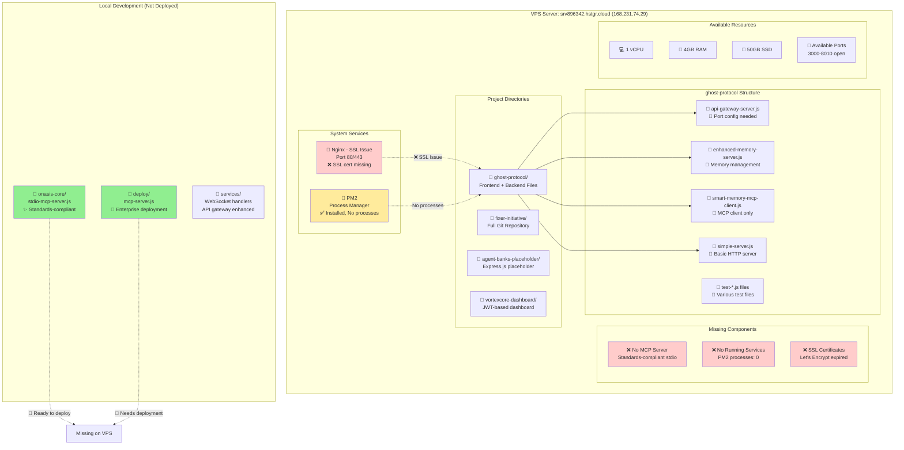

# Current VPS Architecture Diagram
**Generated:** August 22, 2025 15:02 UTC  
**Server:** srv896342.hstgr.cloud (168.231.74.29)  
**Analysis By:** Claude Code  

## 🗺️ Current VPS Architecture



## 📊 Current Status Summary

### ✅ **Available Infrastructure**
- **VPS Resources**: 1 vCPU, 4GB RAM, 50GB SSD
- **Network**: Ports 3000-8010 open
- **Process Manager**: PM2 installed and ready
- **Web Server**: Nginx installed (needs SSL fix)
- **Development Code**: Complete MCP implementation ready locally

### ❌ **Critical Issues**
1. **No Running MCP Server**: Only client exists, no stdio server
2. **SSL Certificate Expired**: Nginx failing for api.connectionpoint.tech
3. **No Active Services**: PM2 showing 0 processes
4. **Deployment Gap**: Local MCP code not transferred to VPS

### 🏗️ **Existing Project Structure**
```
/root/
├── ghost-protocol/              # Frontend + limited backend
│   ├── api-gateway-server.js    # API gateway (needs config)
│   ├── enhanced-memory-server.js # Memory management
│   ├── smart-memory-mcp-client.js # MCP client only
│   └── test-*.js               # Various test files
├── fixer-initiative/           # Full git repository  
├── agent-banks-placeholder/    # Express.js placeholder
└── vortexcore-dashboard/       # JWT-based dashboard
```

### 🎯 **Immediate Needs**
1. Deploy standalone MCP server from onasis-core
2. Fix SSL certificates and nginx configuration
3. Configure proper domain routing
4. Establish PM2 process management
5. Set up Supabase connection with SSL certificate

---

**Next Steps**: See COMPREHENSIVE-MCP-DEPLOYMENT-PLAN-20250822.md