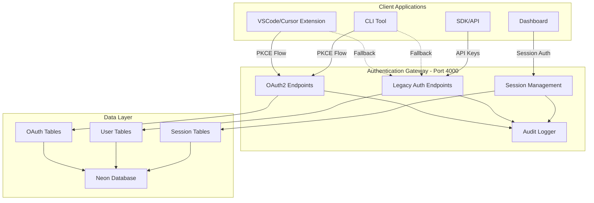
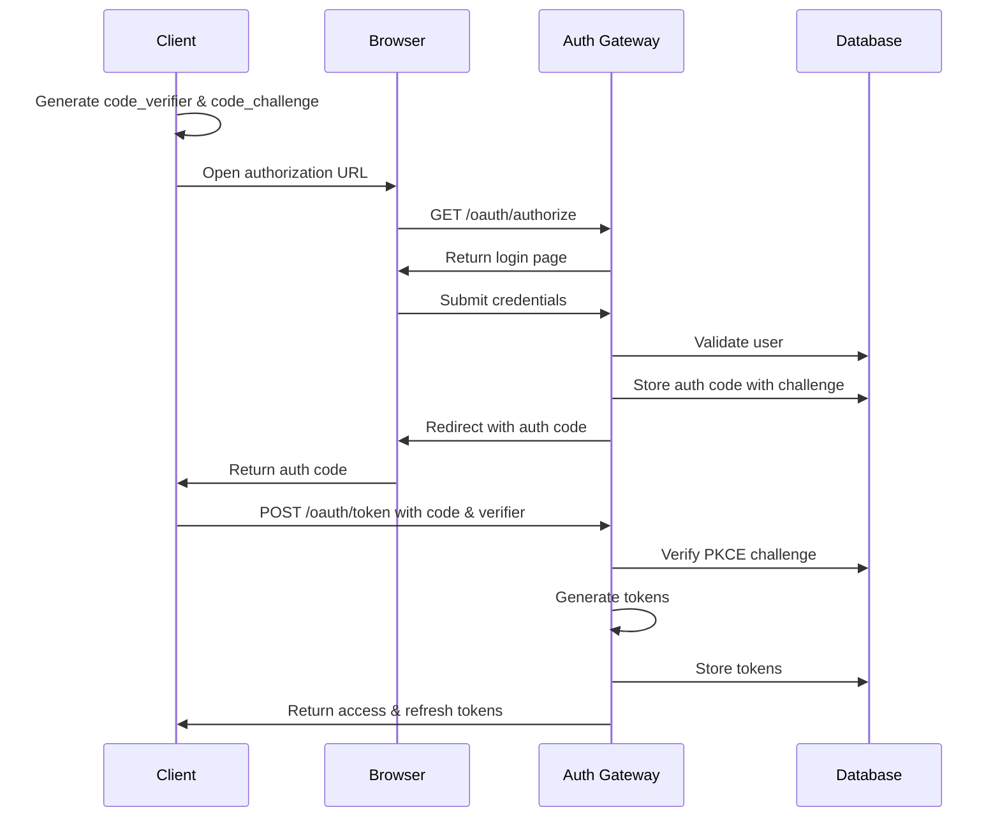

# OAuth2 PKCE Implementation Plan

**Date**: 2025-11-02  
**Service**: auth-gateway (port 4000)  
**Strategy**: Phased rollout with backward compatibility

## Executive Summary

This plan provides a clear, phased approach to implementing OAuth2 with PKCE for the auth-gateway service. The implementation preserves existing authentication methods while adding modern OAuth2 as the primary authentication mechanism.

## Architecture Overview



## OAuth2 PKCE Flow



## Phase 1: Database Foundation (Day 1)

### Objectives

- Set up OAuth2 database schema
- Verify existing tables remain intact
- Seed initial OAuth clients

### Tasks

1. **Apply database migration**
   - Connect to Neon database
   - Execute `006_oauth2_pkce.sql` migration
   - Verify all 4 OAuth tables created
   - Confirm seed clients inserted

2. **Verify database integrity**
   - Check existing tables unchanged
   - Test foreign key relationships
   - Verify indexes created
   - Test cleanup functions

3. **Create backup and rollback plan**
   - Backup current database state
   - Document rollback procedure
   - Test restore process

### Success Criteria

- ✅ OAuth tables exist in database
- ✅ No existing tables modified
- ✅ Seed clients available
- ✅ Rollback procedure tested

## Phase 2: Core OAuth2 Implementation (Days 2-3)

### Objectives

- Implement OAuth2 authorization endpoints
- Add PKCE validation logic
- Create token management system

### Tasks

1. **Create OAuth2 utilities** (`src/utils/pkce.ts`)
   - PKCE challenge validation
   - Token generation functions
   - Secure token hashing

2. **Implement OAuth service** (`src/services/oauth.service.ts`)
   - Client validation
   - Authorization code management
   - Token lifecycle (create, refresh, revoke)
   - Database interactions

3. **Build OAuth controller** (`src/controllers/oauth.controller.ts`)
   - Authorization endpoint handler
   - Token exchange handler
   - Token refresh handler
   - Token revocation handler

4. **Set up OAuth routes** (`src/routes/oauth.routes.ts`)
   - GET /oauth/authorize
   - POST /oauth/token
   - POST /oauth/revoke
   - POST /oauth/introspect (optional)

5. **Create consent UI** (`src/views/oauth-consent.html`)
   - User-friendly consent page
   - Scope presentation
   - Mobile-responsive design

### Success Criteria

- ✅ All 4 OAuth endpoints functional
- ✅ PKCE validation working
- ✅ Token generation/refresh working
- ✅ TypeScript compilation clean

## Phase 3: Security Hardening (Day 4)

### Objectives

- Add comprehensive security measures
- Implement rate limiting
- Set up audit logging

### Tasks

1. **Input validation**
   - Zod schemas for all OAuth requests
   - Redirect URI validation
   - Scope validation
   - State parameter validation

2. **Rate limiting**
   - 10 req/min on /oauth/authorize
   - 5 req/min on /oauth/token
   - IP-based throttling
   - Client-based quotas

3. **Security headers**
   - CSP for consent page
   - X-Frame-Options
   - Strict-Transport-Security

4. **Audit logging**
   - Log all authorization attempts
   - Track token issuance/refresh
   - Monitor failed validations
   - Suspicious activity detection

### Success Criteria

- ✅ Rate limiting active
- ✅ Input validation comprehensive
- ✅ Audit logs capturing all events
- ✅ Security headers configured

## Phase 4: Client Migration Strategy (Days 5-6)

### Objectives

- Update client applications
- Implement fallback mechanisms
- Ensure zero downtime

### Tasks

1. **VSCode/Cursor Extension**
   - Implement PKCE flow
   - Add SecretStorage integration
   - Create fallback to JWT
   - Test browser redirect flow

2. **CLI Tool**
   - Add browser-based auth
   - Implement local callback server
   - Add --legacy flag for JWT
   - Update config storage

3. **Dashboard**
   - Maintain session-based auth
   - Add OAuth consent flow
   - Test cookie persistence

4. **SDK/API**
   - Keep API key support
   - Add optional OAuth flow
   - Update documentation

### Success Criteria

- ✅ All clients support PKCE
- ✅ Fallback mechanisms working
- ✅ No breaking changes
- ✅ Backward compatibility maintained

## Phase 5: Testing & Validation (Days 7-8)

### Objectives

- Comprehensive testing coverage
- Security validation
- Performance benchmarks

### Test Matrix

| Test Type           | Scope                             | Priority |
| ------------------- | --------------------------------- | -------- |
| Unit Tests          | PKCE validation, token generation | Critical |
| Integration Tests   | Full OAuth flow, token refresh    | Critical |
| Security Tests      | CSRF, injection, timing attacks   | Critical |
| Load Tests          | 1000 concurrent auth requests     | High     |
| Compatibility Tests | All client types                  | High     |
| Rollback Tests      | Database and code rollback        | Medium   |

### Test Scenarios

1. **Happy path flows**
   - Complete PKCE authorization
   - Token refresh cycle
   - Token revocation

2. **Error scenarios**
   - Invalid PKCE verifier
   - Expired auth codes
   - Invalid redirect URIs
   - Replay attacks

3. **Edge cases**
   - Concurrent token requests
   - Network interruptions
   - Database connection issues

### Success Criteria

- ✅ 100% critical path coverage
- ✅ No security vulnerabilities
- ✅ Response time < 500ms
- ✅ Zero data corruption

## Phase 6: Monitoring & Observability (Day 9)

### Objectives

- Set up comprehensive monitoring
- Create alerting rules
- Implement cleanup automation

### Tasks

1. **Metrics collection**
   - OAuth request rates
   - Token issuance/refresh rates
   - Error rates by type
   - Response time percentiles

2. **Alerting rules**
   - Failed auth rate > 10%
   - Response time > 1s
   - Database connection failures
   - Suspicious activity patterns

3. **Cleanup automation**
   - Expired auth codes (hourly)
   - Expired tokens (daily)
   - Old audit logs (monthly)
   - Orphaned sessions

4. **Dashboard creation**
   - OAuth usage statistics
   - Client activity breakdown
   - Error trend analysis
   - Security incident tracking

### Success Criteria

- ✅ All metrics collected
- ✅ Alerts configured and tested
- ✅ Cleanup jobs running
- ✅ Dashboards operational

## Phase 7: Production Rollout (Days 10-11)

### Objectives

- Safe production deployment
- Gradual traffic migration
- Quick rollback capability

### Rollout Strategy

```
Day 10 Morning: Deploy to production (disabled)
Day 10 Afternoon: Enable for internal testing
Day 10 Evening: 10% of VSCode users
Day 11 Morning: 50% of VSCode users
Day 11 Afternoon: 100% of VSCode users
Day 11 Evening: Enable for CLI users
```

### Feature Flags

```javascript
const OAUTH_ROLLOUT = {
  enabled: process.env.OAUTH_ENABLED === "true",
  percentage: parseInt(process.env.OAUTH_PERCENTAGE || "0", 10),
  allowedClients: (process.env.OAUTH_CLIENTS || "").split(","),
  fallbackEnabled: true,
};
```

### Rollback Plan

1. **Immediate rollback** (< 5 min)
   - Disable feature flag
   - No code changes needed
2. **Code rollback** (< 15 min)
   - Revert git commit
   - Rebuild and deploy
   - PM2 reload

3. **Database rollback** (< 30 min)
   - Drop OAuth tables
   - Restore from backup
   - Verify integrity

### Success Criteria

- ✅ Zero downtime deployment
- ✅ Gradual rollout successful
- ✅ Rollback tested
- ✅ No user complaints

## Phase 8: Documentation & Training (Day 12)

### Objectives

- Complete documentation
- Team knowledge transfer
- Client migration guides

### Deliverables

1. **Technical documentation**
   - API specification
   - Security architecture
   - Database schema
   - Troubleshooting guide

2. **Client integration guides**
   - VSCode extension guide
   - CLI integration guide
   - SDK usage examples
   - Migration checklist

3. **Operational runbooks**
   - Monitoring procedures
   - Incident response
   - Scaling guidelines
   - Backup/restore procedures

4. **Team training**
   - Architecture walkthrough
   - Code review session
   - Security best practices
   - Support procedures

### Success Criteria

- ✅ All documentation complete
- ✅ Team trained
- ✅ Runbooks tested
- ✅ Support ready

## Risk Assessment & Mitigation

| Risk                        | Impact | Probability | Mitigation                         |
| --------------------------- | ------ | ----------- | ---------------------------------- |
| PKCE validation bugs        | High   | Medium      | Extensive testing, gradual rollout |
| Database migration failure  | High   | Low         | Backup, tested rollback            |
| Client compatibility issues | Medium | Medium      | Fallback to JWT, phased migration  |
| Performance degradation     | Medium | Low         | Load testing, caching, monitoring  |
| Security vulnerabilities    | High   | Low         | Security audit, rate limiting      |

## Timeline Summary

| Phase                        | Duration | Dependencies | Risk Level |
| ---------------------------- | -------- | ------------ | ---------- |
| Phase 1: Database            | 1 day    | None         | Low        |
| Phase 2: Core Implementation | 2 days   | Phase 1      | Medium     |
| Phase 3: Security            | 1 day    | Phase 2      | Low        |
| Phase 4: Client Migration    | 2 days   | Phase 2      | Medium     |
| Phase 5: Testing             | 2 days   | Phase 3, 4   | Low        |
| Phase 6: Monitoring          | 1 day    | Phase 5      | Low        |
| Phase 7: Rollout             | 2 days   | Phase 6      | High       |
| Phase 8: Documentation       | 1 day    | Phase 7      | Low        |

**Total Duration**: 12 days (2.5 weeks)

## Key Success Metrics

1. **Technical Metrics**
   - Zero data loss
   - < 500ms auth response time
   - 99.9% uptime during migration
   - Zero security incidents

2. **User Metrics**
   - < 1% increase in auth failures
   - 90% clients migrated in 30 days
   - Zero forced logouts
   - < 5 support tickets

3. **Business Metrics**
   - Improved security posture
   - Standards compliance (OAuth2 RFC)
   - Reduced password exposure
   - Enhanced audit trail

## Conclusion

This phased approach ensures a secure, scalable OAuth2 PKCE implementation while maintaining complete backward compatibility. The gradual rollout minimizes risk, and comprehensive testing ensures reliability. With proper monitoring and documentation, this implementation will provide a solid foundation for modern authentication across all client types.

---

**Next Steps**:

1. Review and approve this plan
2. Allocate resources
3. Set up development environment
4. Begin Phase 1 implementation

**Questions to Consider**:

- Do we need additional security measures?
- Should we adjust the rollout timeline?
- Are there specific compliance requirements?
- Do we need external security audit?
